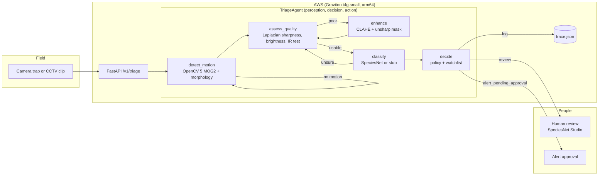

# Architecture

```mermaid
flowchart LR
  subgraph Field["Field"]
    CT[Camera trap or CCTV clip]
  end
  subgraph AWS["AWS (Graviton t4g.small, arm64)"]
    API[FastAPI /v1/triage]
    subgraph Agent["TriageAgent (perception, decision, action)"]
      M[detect_motion<br/>OpenCV 5 MOG2 + morphology]
      Q[assess_quality<br/>Laplacian sharpness, brightness, IR test]
      E[enhance<br/>CLAHE + unsharp mask]
      C[classify<br/>SpeciesNet or stub]
      D[decide<br/>policy + watchlist]
    end
    T[(trace.json)]
  end
  subgraph People["People"]
    R[Human review<br/>SpeciesNet Studio]
    A[Alert approval]
  end
  CT --> API --> M --> Q
  Q -- poor --> E --> Q
  Q -- usable --> C
  C -- unsure --> Q
  C --> D
  D -- log --> T
  D -- review --> R
  D -- alert_pending_approval --> A
  M -- no motion --> M
```

The loop is the point: the visual measurements (motion area, brightness, sharpness, classifier score) change which tool is called next, and alerts wait for a person.
